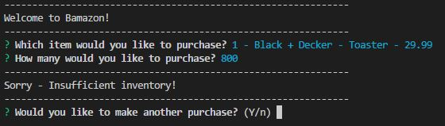
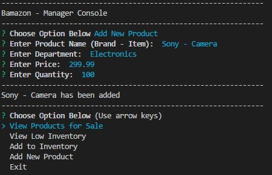

# Bamazon - Node.js & MySQL App

## Description

Bamazon is a CLI storefront created with Node.js and MySQL.  The application consists of three interfaces to accomplish different tasks.

### #1 - Bamazon-Customer

bamazonCustomer.js pulls a products table from a MySQL database and displays all the product available to a customer.  The customer can select an item and enter the quantity they want to purchase.  The application will check the inventory, if sufficient, it will place the order and deduct the quantity from inventory and return the order total.  If not sufficient, it will return "Sorry - Insufficient quantity!".

#### How To Run

* node.js bamazonCustomer.js

* Step 1: Start Screen - Displays all items available

* Step 2: Once item has been selected, it will prompt for quantity

* Step 3: If quantity is sufficient, order is placed and shows the total.

* Step 4: If insufficient, it will prompt insufficient and ask the customer if they want to make another purchse

* Step 5: Make another purchase?

* Step 6: Exit

### #2 - Bamazon-Manager Console

bamazonManager.js lets you: 
* View Products for Sale
* View Low Inventory (Set to <5)
* Add to Inventory
* Add New Product

#### How To Run

* node.js bamazonManager.js

* Step 1: Start Screen - Choose an option

* Step 2: View Products for Sale

* Step 3: View Low Inventory (displays any items that have an inventory of <5)

* Step 4: Add to inventory
    * Select item from list
    * Enter quantity to be added
    * Confirmation

* Step 5: Add New Product
    * Eneter Product Name
    * Enter Department
    * Enter Price
    * Enter Quantity

### #2 - Bamazon-Manager Console

bamazonSupervisor.js lets you:
* View Product Sales by Department
* Create a New Department

#### How To Run

* node.js bamazonManager.js

* Step 1: Start Screen - Choose an option

* Step 2: View Product Sales by Deparment

* Step 3: Create a New Department
    * Enter Department Name
    * Enter Over Head Costs
    * Confirmation

